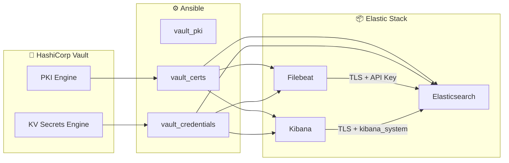

# 🔐 ELK Stack sécurisée avec Vault PKI & Ansible


---

## 📌 Description

Ce projet déploie une stack complète **Elasticsearch + Kibana + Filebeat** automatisée avec **Ansible**, sécurisée via **HashiCorp Vault PKI**.

✔ Zéro secret en dur  
✔ Certificats dynamiques  
✔ TLS bout-en-bout  
✔ Infrastructure reproductible  

---

## 🏗️ Architecture globale

```text
                  ┌──────────────┐
                  │   Vault      │
                  │ (PKI + KV2)  │
                  └──────┬───────┘
                         │
 ┌───────────────────────┼───────────────────────┐
 ▼                       ▼                       ▼
┌──────────────┐   ┌──────────────┐   ┌──────────────┐
│ Elasticsearch│   │ Kibana       │   │ Filebeat     │
│ TLS + Auth   │   │ TLS + Auth   │   │ Logs Docker  │
└──────┬───────┘   └──────┬───────┘   └──────┬───────┘
       │                  │                  │
       └──────────────┬───┴──────────────────┘
                      ▼
               🔐 CA Vault PKI
```

---

## 🏗️ Architecture détaillée (Mermaid)



---

## 🔐 Sécurité

- TLS généré dynamiquement via Vault PKI  
- Secrets stockés dans Vault KV2  
- Keystore utilisé (Kibana / Filebeat)  
- API Key Elasticsearch pour ingestion  
- Aucun mot de passe en clair  

---

## ⚙️ Prérequis

- Ansible ≥ 2.14  
- HashiCorp Vault  
- Collections :
  - community.hashi_vault
  - ansible.posix

---

## 🚀 Deployment

```bash
ansible-playbook site.yml
```

---

## 🎯 Scope

Infrastructure de lab DevOps simulant un environnement de production sécurisé basé sur TLS + Vault PKI.

## 🧠 Design Principles

- Infrastructure as Code
- Zero Trust TLS by default
- Centralized secrets management
- Idempotent automation